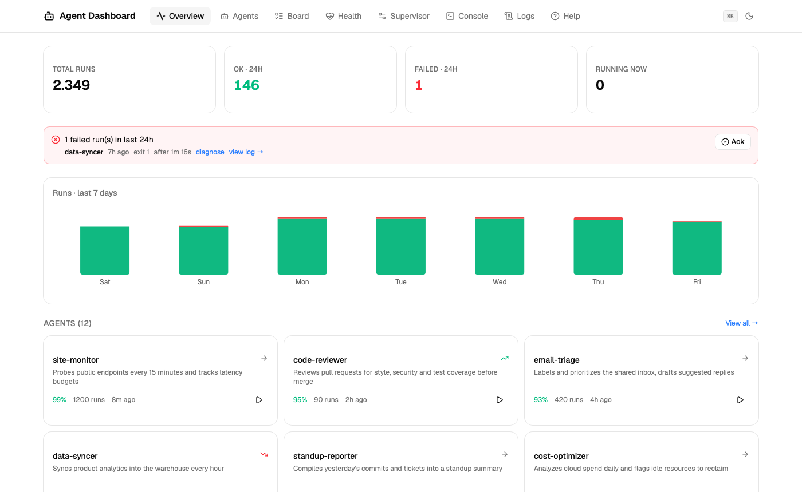
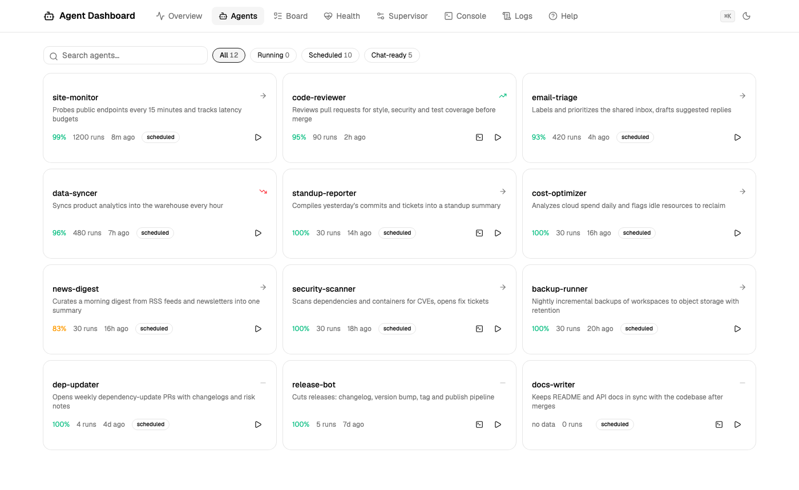
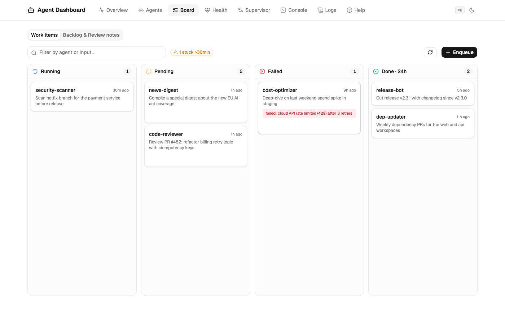
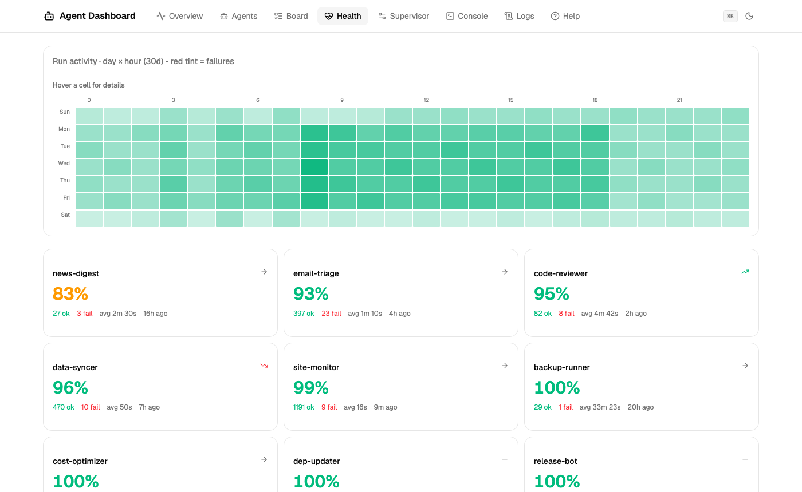
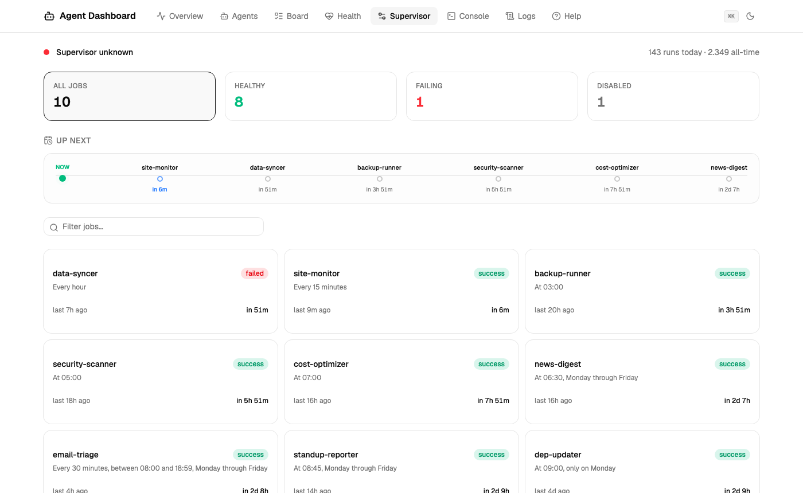
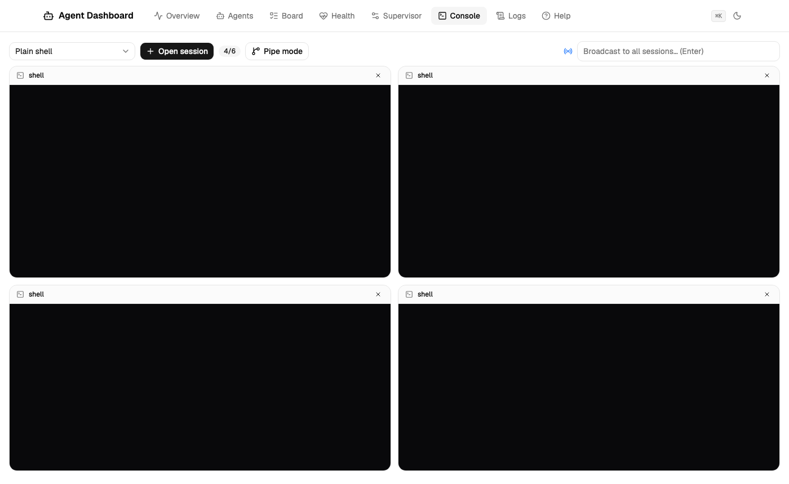
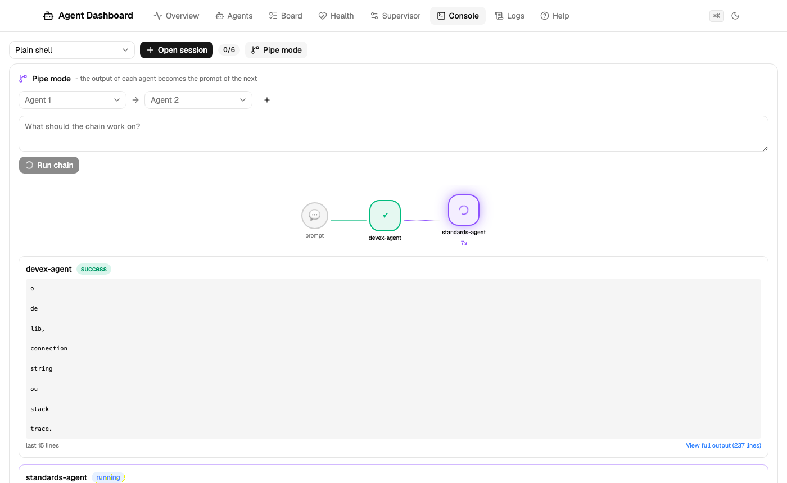
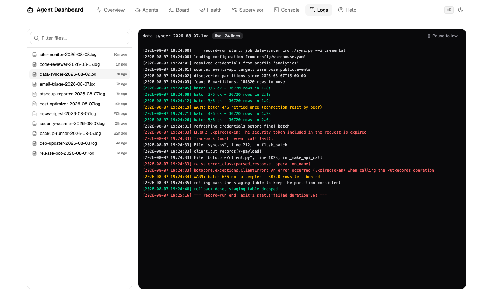
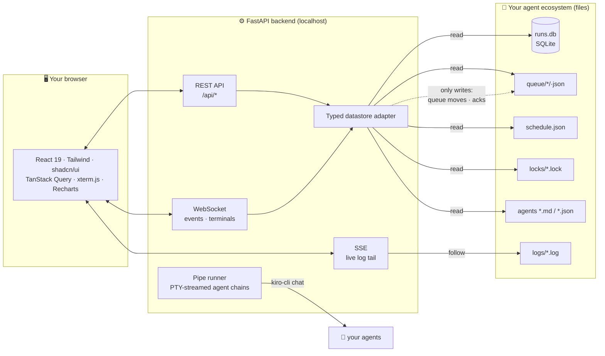

# Agent Dashboard

**Local-first observability for AI agent ecosystems.** Built for [Kiro CLI](https://kiro.dev) agents, adaptable to anything that can record a run - cron jobs, launchd services, Claude Code hooks.

Watch your agents live: what ran, what failed and *why*, what's queued, when everything happens - plus a multi-terminal console to chat with several agents at once and pipe them into each other.



## Why - your AI agents need infrastructure too

Running AI agents locally sounds simple - until you need scheduling, concurrency control, crash recovery and observability. Without infrastructure, agents are **fragile scripts that silently fail, leak processes and produce inconsistent results**.

This dashboard is the observability half of that missing layer: not a wrapper around an LLM, but **DevOps for AI agents** - the gap between "I have a prompt" and "I have reliable automation".

> "I went from 'run a script and hope' to a self-managing fleet of agents with full observability." - the itch this project scratches

- 🏠 **Local-first** - your data never leaves your machine. No cloud dependency, no account, no telemetry.
- ⚡ **Real-time** - a WebSocket event channel updates every open page within ~1 second.
- 🔍 **Failure diagnosis** - one click explains a failed run: exit-code meaning, the run's own log segment, and known-pattern detection (expired auth, missing deps, timeouts, rate limits...). Every run logged, every failure categorized.
- 🖥️ **Multi-terminal console** - up to 6 simultaneous PTY sessions that **survive page refreshes**, with a broadcast bar to ask all agents the same thing.
- 🔗 **Pipe mode** - multi-agent orchestration made visible: chain agents so the output of one becomes the prompt of the next, with an animated flow view, live streaming and visible hand-offs.
- 📅 **A real scheduler view** - if your agents run on plain cron (launchd, crontab), the Supervisor gives them what cron never had: plain-English schedules, next-run countdowns, failure pinning, one-click runs, inline cron editing and enable/disable.
- 📦 **Battle-tested at scale** - born from an ecosystem of 20+ autonomous agents running on a single laptop with zero manual maintenance: the dashboard is how that fleet stays observable.

## Platform support

- **macOS** - fully supported.
- **Linux** - fully supported (validated end-to-end on Ubuntu 24.04 / EC2).
- **Windows** - via WSL2 (the terminals and pipe mode use Unix PTYs). Note: WSL2 shuts a distro down when its last process exits, so run the server in a session you keep open (a terminal window, `tmux`, or a systemd unit with `systemd=true` in `/etc/wsl.conf`).

## Feature tour

| | |
|---|---|
| **Agents** - searchable grid with health scores, trends and one-click run/terminal |  |
| **Board** - work-items kanban (running / pending / failed / done) with retry, cancel and detail panel; plus Backlog & Review-notes views |  |
| **Health** - day×hour activity heatmap (failure-tinted) + worst-first score cards |  |
| **Supervisor** - clickable KPI filters, "up next" countdowns, cron in plain English |  |
| **Console** - multi-terminal grid, agent chat sessions that survive refreshes, broadcast bar |  |
| **Pipe mode** - chain agents with an animated flow view and live-streamed output (~1s latency) |  |
| **Logs** - live tail with SSE, error highlighting, deep-linkable files |  |

Per-agent observability: 30-day P50/P95/P99 duration percentiles and success-rate charts on every agent page.

## Quick start

Requirements: Python 3.12+, [uv](https://docs.astral.sh/uv/), Node 20+, `sqlite3` CLI (only needed by `bin/record-run`).

<details><summary>Debian/Ubuntu one-liner (including WSL2)</summary>

```bash
sudo apt-get update && sudo apt-get install -y git sqlite3 curl python3-venv
curl -fsSL https://deb.nodesource.com/setup_22.x | sudo -E bash - && sudo apt-get install -y nodejs
curl -LsSf https://astral.sh/uv/install.sh | sh
```
Note: install `python3-venv` (unversioned) - pinning a version like `python3.12-venv` breaks on newer Ubuntu releases that ship a different Python.
</details>

```bash
git clone https://github.com/brunokktro/agent-dashboard.git
cd agent-dashboard

# frontend (build once - FastAPI serves the result)
cd frontend && npm install && npm run build && cd ..

# backend
cd backend && uv sync
DASHBOARD_AGENTS_DIR=~/.kiro/agents uv run uvicorn dashboard.main:app --port 7780
```

Open **http://localhost:7780**. Fresh install with no data? The Overview shows you exactly how to record your first run.

### Recording runs from ANY scheduler

The universal adapter wraps any command and records it (job id, duration, status, exit code, log):

```bash
bin/record-run nightly-backup ./backup.sh
bin/record-run lint-check npm run lint
```

Works from cron, launchd, Makefiles, CI, Claude Code hooks. Recorded runs appear everywhere: Overview, Health, heatmap, diagnosis.

### Run it as a KiroCrew app

If you use [KiroCrew](https://kiro.dev/docs/crew/), this dashboard is also packaged as a **Crew App** - the `app.json` at the repo root is the manifest. Installed as an app, it shows up in the Crew sidebar with everything working (terminals and live streams included), the backend is spawned and health-checked by the gateway on an automatic port, and **no Node or manual build is needed** - the built UI ships in the repo.

> **Coming to the App Store registry:** agent-dashboard has been submitted to the official KiroCrew App Registry ([kirodotdev/KiroCrew#3241](https://github.com/kirodotdev/KiroCrew/pull/3241)). Once merged, it installs with one click from the App Store tab.

**Where the built bundles live.** `main` never tracks build output - it is a source branch. The App Store installs from the **`release`** branch, which is `main` plus one generated commit carrying the built `frontend/dist` and `ui/dist`, so an install needs no Node on the target machine (the installer never runs a build). That branch is produced, never hand-edited:

```bash
bin/make-release            # build both bundles, publish the release branch, verify by blob hash
bin/make-release --dry-run  # show what would be published
```

Until then (or for development), install from a local clone:

```bash
# third-party apps must be explicitly allowed once, then restart the gateway
#   ~/.kiro/crew/config.json -> "agent": { "apps_allow_third_party": true }
kirocrew app install /path/to/agent-dashboard
kirocrew app enable agent-dashboard
kirocrew restart
```

Open the Crew dashboard and click **Agent Dashboard** in the sidebar. Per-app settings (hide agents you do not operate, site-specific failure hints) live in the host's `data/config.json` - see [Configuration](#configuration).

## Support agent

`agents/dashboard-support` is an agent that installs and troubleshoots **this** project: a `.md` spec plus a kiro-cli `.json` config, with the command-level playbooks under `agents/dashboard-support-data/references/`. Link both files into your ecosystem and it shows up in the dashboard like any other agent, chat and terminal included:

```bash
ln -s "$PWD/agents/dashboard-support.md"   "${DASHBOARD_AGENTS_DIR:-$HOME/.kiro/agents}/"
ln -s "$PWD/agents/dashboard-support.json" "${DASHBOARD_AGENTS_DIR:-$HOME/.kiro/agents}/"
```

### Guided install - local, self-service

You just cloned the repo and something does not work. The agent detects the actual state of the machine (OS incl. WSL2, Python 3.12+, Node 20+, uv, `sqlite3`, whether `frontend/dist` was built, whether `DASHBOARD_AGENTS_DIR` exists and has a `runs.db`, whether the port is free), reports it as a table, and gives you the exact commands in dependency order - runtimes, then the frontend build, then `uv sync`, then the server.

It knows the traps that are not obvious from the outside: `dist/` is gitignored so there is no UI until you build; WSL2 shuts the distro down when its last process exits; `bin/record-run` needs the `sqlite3` CLI; and an empty dashboard on a fresh install is *correct*, because the dashboard consumes artifacts it does not create.

It closes by validating for real - the server up, an HTTP check on `/` that must return HTML and not just any 200, and a throwaway `record-run` that has to appear in the API. An exit code from an intermediate step is never accepted as success.

The detection phase is also a standalone script - run it yourself and paste the output when asking for help anywhere:

```bash
bin/collect-diagnostics
```

It reports platform, runtime versions, build state, ecosystem state, port and server health in one block, treats a missing binary as data rather than a failure, and prints no secrets (environment variables come out as SET/UNSET only).

### Remote troubleshooting - over a chat DM

Hand the agent a Slack user id and it runs the same diagnosis conversationally, asynchronously, in the other person's language (pt-BR, en-US, es - guessed from their profile locale, then mirrored from their reply). It states in the first message that it will wait at most 5 minutes, then waits with a bound instead of hanging.

Which Slack client does the talking is deliberately unspecified: the spec lists the four capabilities it needs (open a DM, post a message, read history since a point, download a file) and you map them to any Slack MCP server configured in your environment. Ids and handles are runtime inputs - the files only ever carry placeholders like `<SLACK_USER_ID>`.

The wait window is a standalone script, usable on its own:

```bash
bin/await-reply --timeout 300 --interval 15 -- <read-new-messages-command> "<CONVERSATION_ID>"
```

It polls your fetch command until it prints something, and separates the three outcomes that matter:

| Exit | Meaning |
|------|---------|
| `0` | reply received - payload on stdout |
| `3` | window closed with no reply - send the closing message and stop |
| `4` | every poll failed - state unknown, do **not** report it as "no reply" |

That last one exists because a failed read reported as silence is a lie that looks like a fact.

## Configuration

Everything is environment-driven - no hardcoded paths.

| Env var | Default | Description |
|---------|---------|-------------|
| `DASHBOARD_AGENTS_DIR` | `~/.kiro/agents` | Root of the observed ecosystem |
| `DASHBOARD_PORT` | `7780` | HTTP port |
| `DASHBOARD_SUPERVISOR_SERVICE` | _(empty)_ | launchd/systemd service name for supervisor status |
| `DASHBOARD_BIG_LOG_MB` | `50` | Large-log alert threshold |
| `DASHBOARD_STUCK_AFTER_MINUTES` | `30` | Stuck queue item threshold |
| `DASHBOARD_EXCLUDE_AGENTS` | `[]` | Glob patterns of agent names to hide from every view, JSON list (e.g. `'["vendor-*","*-heartbeat"]'`) - useful for vendor-installed agents you do not operate |
| `DASHBOARD_INCLUDE_AGENTS` | `[]` | Allowlist: when set, ONLY agents matching these globs are shown. Exclusions still win |
| `DASHBOARD_UPSTREAM_REPO` | `brunokktro/agent-dashboard` | `owner/name` checked by the header's update button; empty disables the check |
| `DASHBOARD_EXTRA_HINTS` | `[]` | Site-specific failure hints for the run diagnosis, JSON list of `[regex, hint]` pairs matched against the failing run's log (e.g. `'[["corp-sso","SSO expired - re-authenticate"]]'`) - keeps internal tool names out of the code |

Running under an app host (e.g. as a KiroCrew app) the backend gets a minimal environment, so `DASHBOARD_*` vars cannot reach it. There, the host's per-app settings file is the configuration channel: `$KIROCREW_HOME/apps/agent-dashboard/data/config.json` (editable via the host's `PUT /api/apps/agent-dashboard/config`), accepting `exclude_agents`, `extra_hints`, `big_log_mb`, `stuck_after_minutes`, `job_agent_overrides` and `agent_deps` with the same shapes as the env vars. Recognized keys override the environment; the file is optional.

## Runner scripts - the two optional execution hooks

Fastest path: `bin/init-ecosystem` scaffolds them for you (and can install the service unit). It is non-destructive - an existing file is reported and skipped, never overwritten:

```bash
bin/init-ecosystem             # report what is missing; writes nothing
bin/init-ecosystem --runners   # scaffold run-agent.sh + run-scheduled.sh (+ empty schedule.json)
bin/init-ecosystem --service   # launchd (macOS) or systemd --user (Linux) unit, so it survives a reboot
bin/init-ecosystem --all       # both
bin/init-ecosystem --runners --force   # refresh the templates, moving yours to <file>.bak-<timestamp>
```

Works the same on a **fresh clone and on an install you already have running** - if you cloned before this script existed, `git pull` and run it. Re-running is safe: existing files are reported as `KEPT` and never silently overwritten; `--force` backs yours up first, so nothing is ever lost.

The scaffolded runners assume kiro-cli and wrap each run with `bin/record-run`, which is what makes it appear in the dashboard - edit the one `RUN=` line for your own setup.

### Starter agents and jobs - so day one is not empty

A fresh install observes an empty ecosystem and therefore looks dead. `bin/install-starters` gives it a heartbeat and a routine, with work that is actually useful:

```bash
bin/install-starters             # show what would be installed
bin/install-starters --scripts   # heartbeat (every 15 min) + log-hygiene (weekly) - no LLM needed
bin/install-starters --agents    # failure-triage + dashboard-support (need kiro-cli)
bin/install-starters --all
```

`heartbeat` verifies the server serves the app (200 **and** HTML) and that the API reads your ecosystem, which also means the Overview, heatmap and health score have real data from the first quarter hour. `log-hygiene` compresses logs past the large-log threshold and never deletes. `failure-triage` diagnoses the last 24h of failures through the dashboard's own `/diagnose` endpoint. Schedule entries are merged, so a job id you already have is never rewritten.

Details and how to write your own: [`starters/README.md`](starters/README.md). Anything tied to a system only you can reach (internal account tooling, a private API) belongs in your own ecosystem rather than a public repo - the starters ship the shape, you keep the specifics.

### Scoping which agents you see

A shared agents directory (`~/.kiro/agents` is the default) usually holds agents installed by other tools too. Two ways to narrow it, and they compose:

| Approach | How | When |
|----------|-----|------|
| Separate ecosystem | `DASHBOARD_AGENTS_DIR=~/my-agents` | full isolation - its own `runs.db`, queue and schedule |
| Filter a shared dir | `DASHBOARD_INCLUDE_AGENTS='["my-*","ops-*"]'` (allowlist) and/or `DASHBOARD_EXCLUDE_AGENTS='["Vendor*"]'` (denylist) | keep one ecosystem, hide what you do not operate |

An allowlist usually beats chasing a growing denylist. Exclusions win over inclusions, so you can allow a broad pattern and still carve out exceptions.

### Update check

The header has a **version button**: click it and the dashboard compares your version against the upstream repo's `app.json`. It only calls out when you click - there are no background network requests - and a check that fails says so instead of claiming you are up to date. Point it at your own fork with `DASHBOARD_UPSTREAM_REPO=owner/name`, or set it empty to disable the check entirely.

The rest of this section is the contract, if you would rather write them yourself.

The dashboard **observes** your ecosystem; it does not ship an agent runtime. The two "run" buttons delegate to scripts that live in YOUR ecosystem, at `$DASHBOARD_AGENTS_DIR/scripts/`:

| Script | Called by | Contract |
|--------|-----------|----------|
| `run-agent.sh <agent-name> run --no-interactive` | the Run button on an agent | executes the agent once; stdout/stderr are captured to `logs/adhoc-<agent>-<stamp>.log` |
| `run-scheduled.sh <job-id> <script> <timeout-sec>` | the Run button on a scheduled job | executes the job the same way the scheduler would (and should record the run into `runs.db`, e.g. via `bin/record-run`) |

If a script is absent, the Run buttons render **disabled**, with a tooltip naming the file you need - the API also answers `503` with the same detail for anyone calling it directly. Everything else (Overview, Health, Logs, Queue, diagnosis) works without them. A minimal `run-agent.sh` for kiro-cli users:

```bash
#!/usr/bin/env bash
# $DASHBOARD_AGENTS_DIR/scripts/run-agent.sh
exec kiro-cli chat --agent "$1" --no-interactive
```

Wrap it with `bin/record-run "$1" ...` if you also want the run to land in `runs.db`.

## Data contracts

The dashboard reads, under `DASHBOARD_AGENTS_DIR`:

| Artifact | Shape |
|----------|-------|
| `runs.db` | SQLite table `runs(job_id, started_at, duration_sec, status, exit_code, log_path)` - auto-created if missing |
| `queue/{pending,running,done,failed}/*.json` | Work items: `{id, agent, input, priority, created, status}` |
| `scripts/schedule.json` | `{"jobs": [{id, script, cron, timeout_sec, enabled}]}` |
| `locks/*.lock` | PID files marking running agents |
| `*.md` | Agent specs with YAML frontmatter (`name`, `description`) |
| `*.json` | kiro-cli agent configs (enables chat/terminal for that agent) |

## Architecture



## Testing philosophy

```bash
cd backend && uv run pytest && uv run ruff check src tests
```

- **Real artifacts, no mocks** - fixtures build a miniature ecosystem in a temp dir: a real SQLite `runs.db`, real queue JSON files, real markdown specs. Mocks mask type errors and schema drift; real files catch them.
- **Property-based invariants** (Hypothesis) - e.g. the health score must stay within 0-100 for ANY run history the generator can invent.
- **Regression-bug-first** - every bug found in real use becomes a failing test before the fix (e.g. queue files whose name differs from the item id, YAML folded descriptions, sort-by-insertion-order assumptions).
- **Fixtures must mirror real-world variance** - the one bug that escaped had a fixture sharing the same assumption as the code. Lesson encoded in the suite.

## Built-in documentation

The **Help tab** inside the app is a full user guide: sidebar navigation, per-feature walkthroughs with screenshots, an onboarding section for Kiro CLI / Claude Code users, the data contracts, and an exit-code cheat-sheet for the failure diagnosis.

## Demo ecosystem - regenerate the screenshots

All screenshots in this README (and in the in-app Help) come from a **generic, deterministic demo ecosystem** - never from anyone's real agents. `demo/seed-demo.py` rebuilds it from scratch:

```bash
python3 demo/seed-demo.py            # writes to demo/demo-agents/ (gitignored)
python3 demo/seed-demo.py /tmp/demo  # or anywhere else
```

It creates 12 fictional agents with specs, configs, a `runs.db` with ~2,300 runs derived from each agent's real cron cadence walking backwards from now, schedule, queue items and logs. Deterministic (fixed seed) and self-checking: it asserts that no run lands in the future - a future-stamped run once rendered `-5358s ago` in a published screenshot, and the assert keeps that bug from coming back.

To capture against it, point the server at the demo tree and use a viewport of 1400x860:

```bash
cd backend
DASHBOARD_AGENTS_DIR=../demo/demo-agents uv run uvicorn dashboard.main:app --port 7781
```

Screenshots land in `docs/img/` AND `frontend/public/help/` (copy first, then `npm run build` - the Help tab serves from `dist/`).

## Notable design details

- **Failure diagnosis** isolates the failing run's own log window (by timestamp) and matches known patterns - expired auth, missing dependencies, PATH issues, rate limits, timeouts - into "probable cause" hints.
- **Terminal sessions are durable**: each PTY lives server-side keyed by session id; a page refresh reattaches and replays recent output (15 min TTL).
- **Pipe jobs are durable too**: persisted to disk, they survive backend restarts and are reported honestly as `lost` if their process died with the server.
- **Directory is the source of truth** for queue state - the JSON `status` field is display-only.
- **Everything real-time** falls back gracefully: if the WebSocket drops, 10s polling keeps the UI honest.

## Related projects

- [Kiro CLI](https://kiro.dev) - the agentic CLI this dashboard was built around
- [KiroCrew](https://github.com/kirodotdev/kirocrew) - multi-agent crews; complements this dashboard (we observe, they orchestrate)

## Roadmap

- [ ] AI-assisted log enrichment on the diagnosis panel
- [ ] Chat companions for script-based agents
- [ ] Pluggable datastore adapters (other run recorders)

## License

[MIT](LICENSE)
