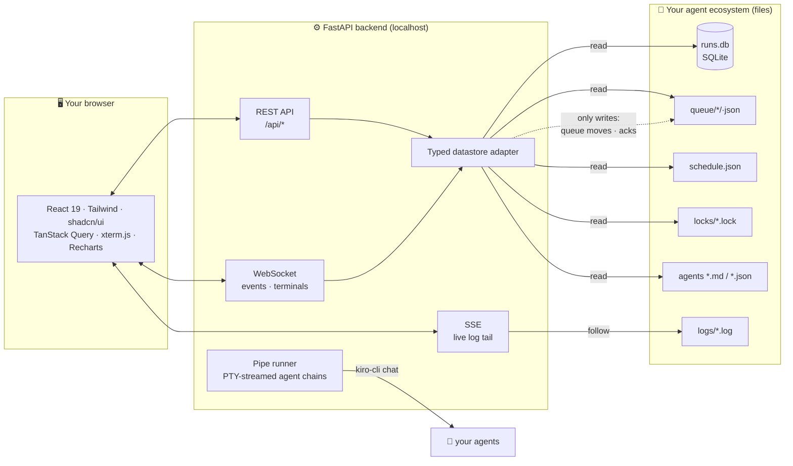

# Agent Dashboard

**Local-first observability for AI agent ecosystems.** Built for [Kiro CLI](https://kiro.dev) agents, adaptable to anything that can record a run - cron jobs, launchd services, Claude Code hooks.

Watch your agents live: what ran, what failed and *why*, what's queued, when everything happens - plus a multi-terminal console to chat with several agents at once and pipe them into each other.


## Why - your AI agents need infrastructure too

Running AI agents locally sounds simple - until you need scheduling, concurrency control, crash recovery and observability. Without infrastructure, agents are **fragile scripts that silently fail, leak processes and produce inconsistent results**.

This dashboard is the observability half of that missing layer: not a wrapper around an LLM, but **DevOps for AI agents** - the gap between "I have a prompt" and "I have reliable automation".

> "I went from 'run a script and hope' to a self-managing fleet of agents with full observability." - the itch this project scratches

- 🏠 **Local-first** - your data never leaves your machine. No cloud dependency, no account, no telemetry.
- ⚡ **Real-time** - a WebSocket event channel updates every open page within ~1 second.
- 🔍 **Failure diagnosis** - one click explains a failed run: exit-code meaning, the run's own log segment, and known-pattern detection (expired auth, missing deps, timeouts, rate limits...). Every run logged, every failure categorized.
- 🖥️ **Multi-terminal console** - up to 6 simultaneous PTY sessions that **survive page refreshes**, with a broadcast bar to ask all agents the same thing.
- 🔗 **Pipe mode** - multi-agent orchestration made visible: chain agents so the output of one becomes the prompt of the next, with an animated flow view, live streaming and visible hand-offs.
- 📅 **A real scheduler view** - if your agents run on plain cron (launchd, crontab), the Supervisor gives them what cron never had: plain-English schedules, next-run countdowns, failure pinning, one-click runs, inline cron editing and enable/disable.
- 📦 **Battle-tested at scale** - born from an ecosystem of 20+ autonomous agents running on a single laptop with zero manual maintenance: the dashboard is how that fleet stays observable.

## Platform support

- **macOS** - fully supported.
- **Linux** - fully supported (validated end-to-end on Ubuntu 24.04 / EC2).
- **Windows** - via WSL2 (the terminals and pipe mode use Unix PTYs). Note: WSL2 shuts a distro down when its last process exits, so run the server in a session you keep open (a terminal window, `tmux`, or a systemd unit with `systemd=true` in `/etc/wsl.conf`).

## Feature tour

| | |
|---|---|
| **Agents** - searchable grid with health scores, trends and one-click run/terminal |  |
| **Board** - work-items kanban (running / pending / failed / done) with retry, cancel and detail panel; plus Backlog & Review-notes views |  |
| **Health** - day×hour activity heatmap (failure-tinted) + worst-first score cards |  |
| **Supervisor** - clickable KPI filters, "up next" countdowns, cron in plain English |  |
| **Console** - multi-terminal grid, agent chat sessions that survive refreshes, broadcast bar |  |
| **Pipe mode** - chain agents with an animated flow view and live-streamed output (~1s latency) |  |
| **Logs** - live tail with SSE, error highlighting, deep-linkable files |  |

Per-agent observability: 30-day P50/P95/P99 duration percentiles and success-rate charts on every agent page.

## Quick start

Requirements: Python 3.12+, [uv](https://docs.astral.sh/uv/), Node 20+, `sqlite3` CLI (only needed by `bin/record-run`).

<details><summary>Debian/Ubuntu one-liner (including WSL2)</summary>

```bash
sudo apt-get update && sudo apt-get install -y git sqlite3 curl python3-venv
curl -fsSL https://deb.nodesource.com/setup_22.x | sudo -E bash - && sudo apt-get install -y nodejs
curl -LsSf https://astral.sh/uv/install.sh | sh
```
Note: install `python3-venv` (unversioned) - pinning a version like `python3.12-venv` breaks on newer Ubuntu releases that ship a different Python.
</details>

```bash
git clone https://github.com/brunokktro/agent-dashboard.git
cd agent-dashboard

# frontend (build once - FastAPI serves the result)
cd frontend && npm install && npm run build && cd ..

# backend
cd backend && uv sync
DASHBOARD_AGENTS_DIR=~/.kiro/agents uv run uvicorn dashboard.main:app --port 7780
```

Open **http://localhost:7780**. Fresh install with no data? The Overview shows you exactly how to record your first run.

### Recording runs from ANY scheduler

The universal adapter wraps any command and records it (job id, duration, status, exit code, log):

```bash
bin/record-run nightly-backup ./backup.sh
bin/record-run lint-check npm run lint
```

Works from cron, launchd, Makefiles, CI, Claude Code hooks. Recorded runs appear everywhere: Overview, Health, heatmap, diagnosis.

## Configuration

Everything is environment-driven - no hardcoded paths.

| Env var | Default | Description |
|---------|---------|-------------|
| `DASHBOARD_AGENTS_DIR` | `~/.kiro/agents` | Root of the observed ecosystem |
| `DASHBOARD_PORT` | `7780` | HTTP port |
| `DASHBOARD_SUPERVISOR_SERVICE` | _(empty)_ | launchd/systemd service name for supervisor status |
| `DASHBOARD_BIG_LOG_MB` | `50` | Large-log alert threshold |
| `DASHBOARD_STUCK_AFTER_MINUTES` | `30` | Stuck queue item threshold |

## Data contracts

The dashboard reads, under `DASHBOARD_AGENTS_DIR`:

| Artifact | Shape |
|----------|-------|
| `runs.db` | SQLite table `runs(job_id, started_at, duration_sec, status, exit_code, log_path)` - auto-created if missing |
| `queue/{pending,running,done,failed}/*.json` | Work items: `{id, agent, input, priority, created, status}` |
| `scripts/schedule.json` | `{"jobs": [{id, script, cron, timeout_sec, enabled}]}` |
| `locks/*.lock` | PID files marking running agents |
| `*.md` | Agent specs with YAML frontmatter (`name`, `description`) |
| `*.json` | kiro-cli agent configs (enables chat/terminal for that agent) |

## Architecture



## Testing philosophy

```bash
cd backend && uv run pytest && uv run ruff check src tests
```

- **Real artifacts, no mocks** - fixtures build a miniature ecosystem in a temp dir: a real SQLite `runs.db`, real queue JSON files, real markdown specs. Mocks mask type errors and schema drift; real files catch them.
- **Property-based invariants** (Hypothesis) - e.g. the health score must stay within 0-100 for ANY run history the generator can invent.
- **Regression-bug-first** - every bug found in real use becomes a failing test before the fix (e.g. queue files whose name differs from the item id, YAML folded descriptions, sort-by-insertion-order assumptions).
- **Fixtures must mirror real-world variance** - the one bug that escaped had a fixture sharing the same assumption as the code. Lesson encoded in the suite.

## Built-in documentation

The **Help tab** inside the app is a full user guide: sidebar navigation, per-feature walkthroughs with screenshots, an onboarding section for Kiro CLI / Claude Code users, the data contracts, and an exit-code cheat-sheet for the failure diagnosis.

## Notable design details

- **Failure diagnosis** isolates the failing run's own log window (by timestamp) and matches known patterns - expired auth, missing dependencies, PATH issues, rate limits, timeouts - into "probable cause" hints.
- **Terminal sessions are durable**: each PTY lives server-side keyed by session id; a page refresh reattaches and replays recent output (15 min TTL).
- **Pipe jobs are durable too**: persisted to disk, they survive backend restarts and are reported honestly as `lost` if their process died with the server.
- **Directory is the source of truth** for queue state - the JSON `status` field is display-only.
- **Everything real-time** falls back gracefully: if the WebSocket drops, 10s polling keeps the UI honest.

## Related projects

- [Kiro CLI](https://kiro.dev) - the agentic CLI this dashboard was built around
- [KiroCrew](https://github.com/kirodotdev/kirocrew) - multi-agent crews; complements this dashboard (we observe, they orchestrate)

## Roadmap

- [ ] AI-assisted log enrichment on the diagnosis panel
- [ ] Chat companions for script-based agents
- [ ] Pluggable datastore adapters (other run recorders)

## License

[MIT](LICENSE)
